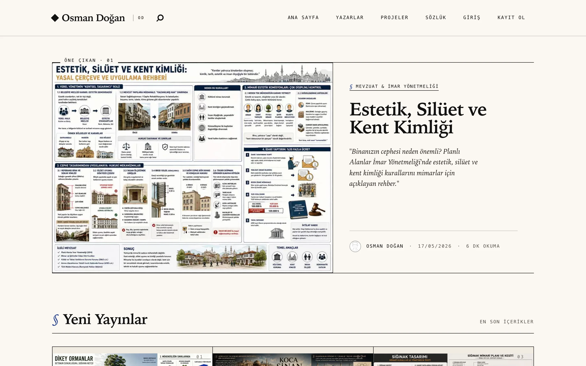
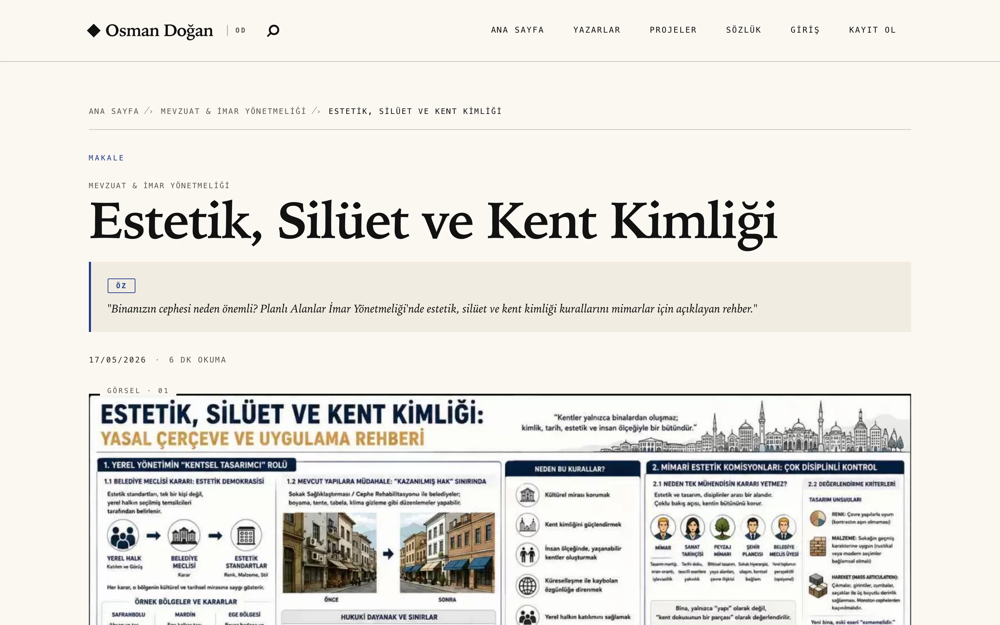
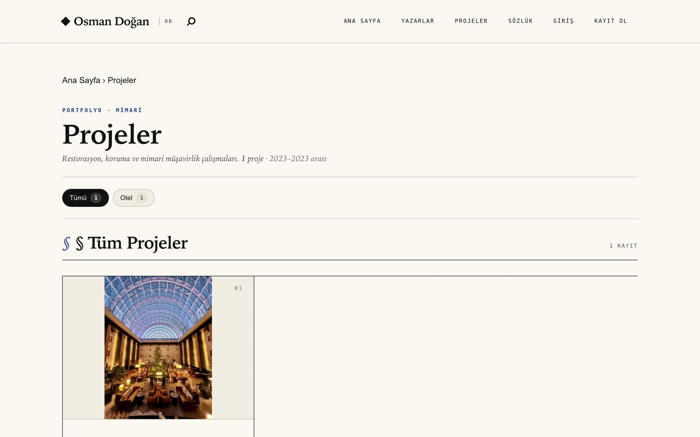
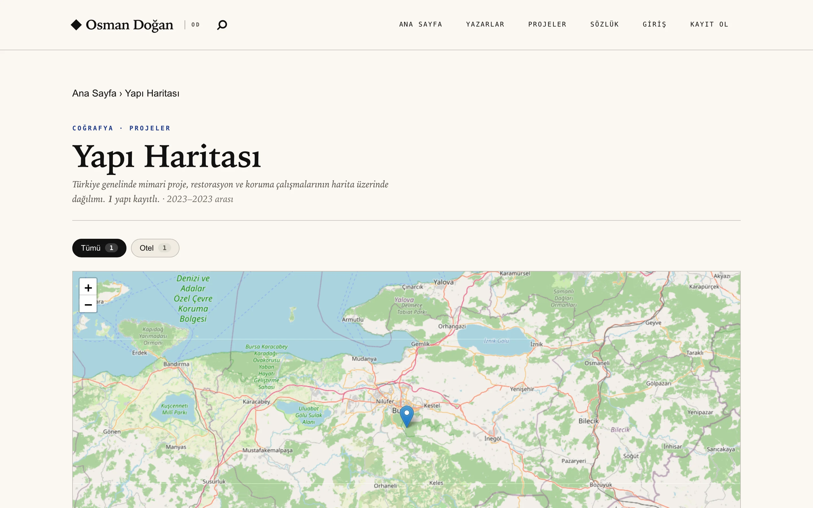
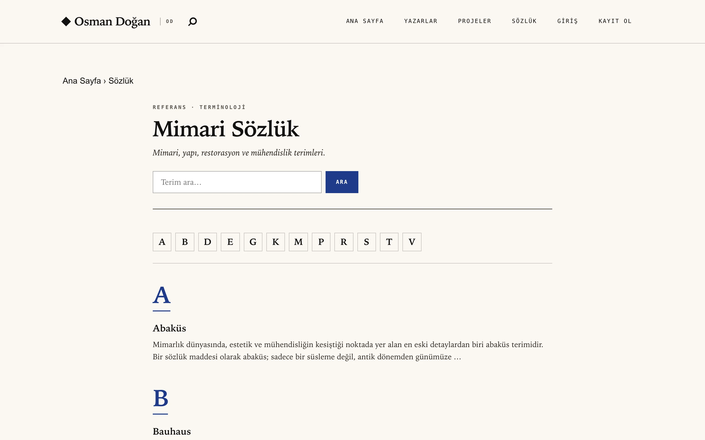
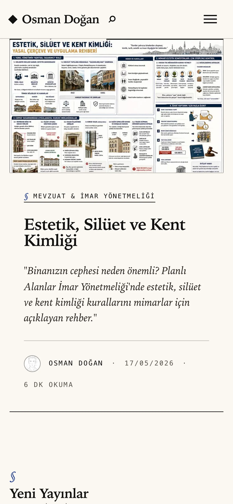
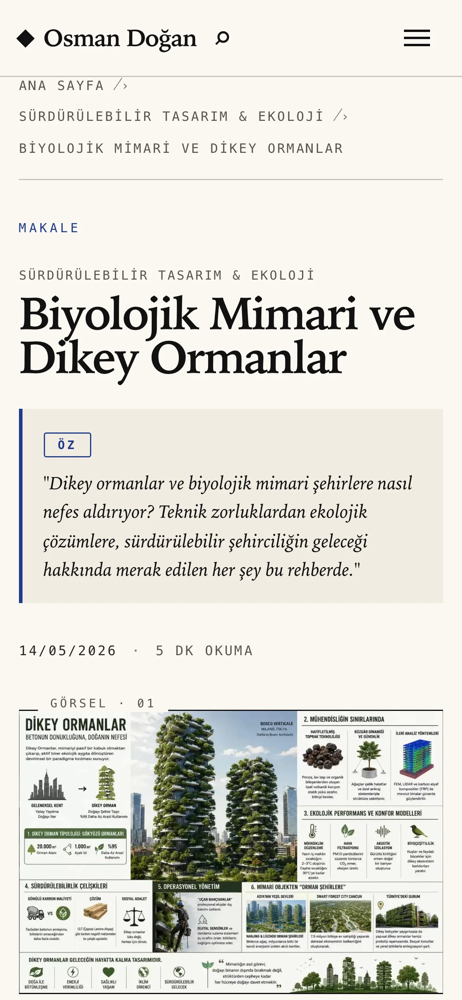
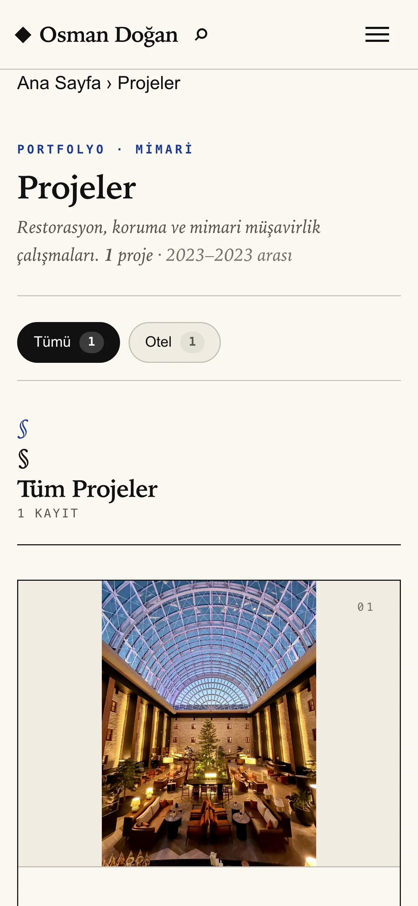
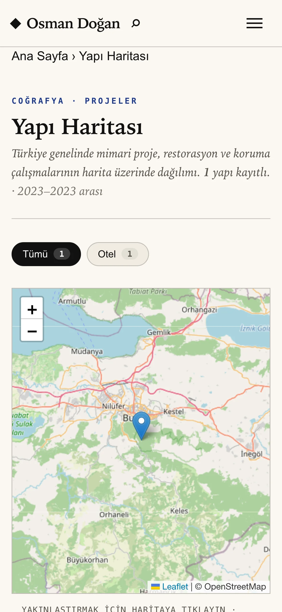
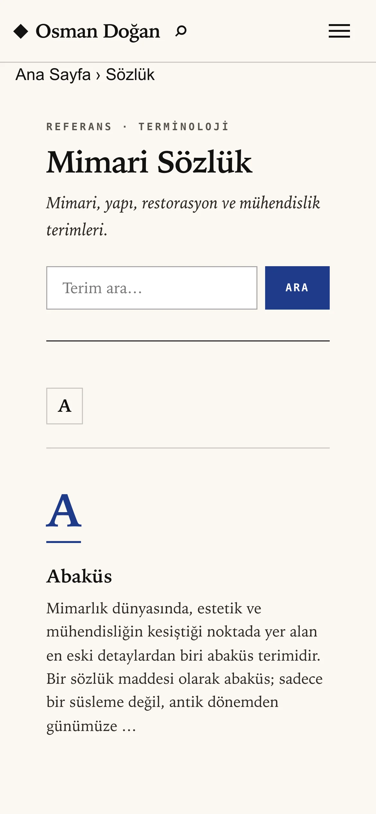

# Odogan CMS

**EN —** A modern, framework-free PHP 8.2+ **architecture blog & portfolio CMS**,
built specifically for [odogan.com.tr](https://odogan.com.tr): an "atelier" aesthetic
for architecture, construction, restoration and engineering content.

**TR —** Modern, framework'süz PHP 8.2+ tabanlı **mimari blog ve portfolio CMS'i**.
[odogan.com.tr](https://odogan.com.tr) için özel geliştirildi — mimari, yapı,
restorasyon ve mühendislik içerikleri için "atelier" estetiğinde.

## Screenshots · Ekran Görüntüleri

### Homepage · Anasayfa — featured + magazine grid



### Post page · Yazı Sayfası — TOC, share, footnote, reactions



### Project portfolio · Proje Portfolyo



### Building map · Yapı Haritası — interactive Leaflet



### Glossary · Sözlük — alphabetical accordion



<details>
<summary><b>Mobile views · Mobile görünümler</b> (click · tıkla)</summary>

<p align="center">
  
  
  
</p>
<p align="center">
  
  
</p>

</details>

> **EN —** Screenshots are auto-generated — refresh with `npm run screenshots`.
> **TR —** Ekran görüntüleri otomatik üretildi — yenilemek için: `npm run screenshots`

## Features · Özellikler

### Content Management · İçerik Yönetimi
- WYSIWYG zengin metin editör (slash komutları, footnote, image gallery)
- Markdown + sanitized HTML dual format
- Co-author / çoklu yazar desteği
- Series (dizi yazılar) + bölüm navigasyonu
- Tag ve kategori sistemi
- Glossary (sözlük) modülü
- Project portfolio + interaktif Leaflet harita

### SEO & Discoverability
- Otomatik XML sitemap (posts/projects/authors/images)
- IndexNow protokolü (Bing/Yandex anında bildirim)
- llms.txt (AI search engine optimizasyonu)
- JSON-LD Schema.org (@graph: Article, Person, Organization, WebSite, FAQPage)
- Siteler arası E-E-A-T entity bağı (kanonik Person `@id`) · cross-site E-E-A-T entity link
- OG image otomatik generator
- Reading progress + table of contents

### Editor Pro Tools · Editör Pro Araçları
- Outline panel (live H2/H3 sidebar)
- Yazı Analizi — birleşik içerik notu (odak kelime + teknik SEO + E-E-A-T + AEO + okunabilirlik) · unified content score
- Türkçe kök-eşleşmeli anahtar kelime motoru · Turkish stem-aware keyphrase engine
- Okunabilirlik puanı (Türkçe Ateşman formülü)
- Opsiyonel AI Derin Analiz (Claude API, talep-üzerine) · optional on-demand AI deep analysis
- Internal link önerisi (FULLTEXT search tabanlı)
- Auto-save + revision history
- Quick edit modal + bulk actions

### Engagement · Etkileşim
- Yorum sistemi (threaded, moderation)
- Clap, bookmark, follow author
- Emoji reactions
- Quote-to-tweet
- Save post (localStorage)
- Newsletter (Brevo entegrasyonu)
- Author follow + email digest

### Security · Güvenlik
- Argon2id password hashing
- TOTP 2FA (RFC 6238)
- CSRF middleware (global)
- Rate limiting (login, register, password reset, analytics)
- HSTS + CSP + X-Frame-Options
- File upload polyglot sanitization
- IndexNow + SMTP encrypted credentials
- Cookie consent (KVKK / Consent Mode V2)
- Forgot password flow + email change pending pattern

### Performance · Performans
- Build pipeline: PurgeCSS + cssnano + Stylelint
- JS pipeline: ESLint + Prettier + Terser + source maps
- AVIF + WebP + JPEG fallback (`<picture>`)
- BlurHash placeholder
- LCP image preload
- Brotli + gzip
- Tag-based cache invalidation
- Critical CSS support

### Accessibility (WCAG 2.2 AA) · Erişilebilirlik
- `prefers-reduced-motion` global
- Modal focus traps (lightbox, gallery, modals)
- `aria-pressed`, `aria-current`, `aria-live`
- Table `<th scope>` + caption
- `:focus-visible` outline consistency
- Skip-link, keyboard navigation

## Tech Stack · Teknoloji Yığını

| Layer · Katman | Stack |
|---|---|
| Backend | PHP 8.2+, MySQL 8.0+, no framework |
| Build | Node 20+, npm, PostCSS, Terser, ESLint, Prettier |
| Cache | File-based (Redis optional · opsiyonel) |
| Mail | Brevo (transactional + newsletter) |
| Error tracking | Sentry |
| Hosting | cPanel / shared (LiteSpeed / Apache) |

## Installation · Kurulum

```bash
# Composer & npm dependencies · bağımlılıkları
composer install
npm install

# Prepare .env · .env hazırla
cp .env.example .env
# Fill DB credentials, APP_URL, SMTP · DB credentials, APP_URL, SMTP ayarları doldur

# DB migrations · migrasyonları
php database/migrate.php

# Build CSS/JS bundles · bundle'ları
npm run build

# Local dev (port 8000)
php -S localhost:8000 router.php
```

## Build Commands · Build Komutları

```bash
npm run css:lint     # Stylelint check · kontrol
npm run css:build    # PurgeCSS + cssnano
npm run js:lint      # ESLint check · kontrol
npm run js:format    # Prettier
npm run js:build     # Terser minify + source map
npm run screenshots  # README screenshots via Playwright + Sharp · ekran görüntüleri
npm run build        # Full pipeline (CSS + JS) · tüm pipeline
```

## Folder Structure · Klasör Yapısı

```
app/                 # PHP application · uygulaması
  ├── Controllers/   # HTTP request handlers
  ├── Models/        # DB entities
  ├── Services/      # Business logic (Auth, Mail, Cache, Schema, ...) · iş mantığı
  ├── Middleware/    # CSRF, Auth, Guest, RateLimit
  ├── Core/          # Router, Request, Response, DB, Cache
  └── Views/         # PHP templates
assets/              # Frontend source (CSS partials, JS) · kaynak
bin/                 # CLI scripts
database/migrations/ # Ordered SQL migrations · sıralı migration'lar
docs/                # DNS, cron, backup guides · rehberleri
scripts/             # npm build scripts
storage/             # cache, logs, backups (runtime)
uploads/             # User-uploaded media
```

## Production Deploy

**EN —** See the detailed guides:
[`docs/DNS_SETUP.md`](docs/DNS_SETUP.md), [`docs/CRON_SETUP.md`](docs/CRON_SETUP.md), [`docs/BACKUP_RESTORE.md`](docs/BACKUP_RESTORE.md).

**TR —** Detaylı rehber için:
[`docs/DNS_SETUP.md`](docs/DNS_SETUP.md), [`docs/CRON_SETUP.md`](docs/CRON_SETUP.md), [`docs/BACKUP_RESTORE.md`](docs/BACKUP_RESTORE.md).

## License · Lisans

MIT — see the [`LICENSE`](LICENSE) file. · bkz. [`LICENSE`](LICENSE) dosyası.

## Contact · İletişim

[odogan.com.tr](https://odogan.com.tr) · [@mimarodogan](https://github.com/mimarodogan)
